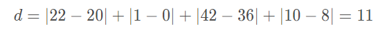

这是本次作业的pdf版本，所使用的编程环境为jupyter lab，程序运行结果可以参见homework1.ipynb

# 作业一

给定两个被元组（22,1,42,10）和（20,0,36,8）表示的对象

（a）计算这两个对象之间的欧几里得距离；

（b）计算这两个对象之间的曼哈顿距离；

（c）使用q=3，计算这两个对象之间的闵可夫斯基距离

（d）计算着两个对象之间的上确界距离

# 创建对象


```python
a = (22, 1, 42, 10)
b = (20, 0, 36, 8)
```

# 欧氏距离


```python
import numpy as np


def euclidean(x, y):
    return np.sqrt(sum((x[i] - y[i]) ** 2 for i in range(len(x))))
```


```python
euclidean(a, b)
```


    6.708203932499369


# 曼哈顿距离





```python
def manhattan(x, y):
    return sum(np.abs(x[i] - y[i]) for i in range(len(x)))
```


```python
manhattan(a, b)
```


    11


# 闵可夫斯基距离


```python
def minkowski(x, y, p):
    return sum(np.abs(x[i] - y[i]) ** p for i in range(len(x))) ** (1 / p)
```


```python
minkowski(a, b, 3)
```


    6.153449493663682


# 上确界距离


```python
def Supremum(x, y):
    return np.abs(max(x) - max(y))
```


```python
Supremum(a, b)
```


    6

