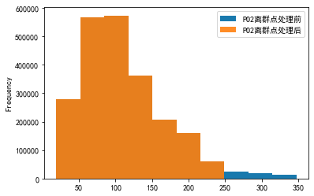

# 题目要求
本次任务的目的是处理PO2，PCO2两个指标。这两个指标均为病人的血气指标，以一定的时间间隔采集。一个病人一次住院期间可能收集一次或者多次。要求，按照采集时间的前后顺序，汇总每个病人每次住院期间的所有的pO2, pCO2指标值。涉及到的预处理方法包括插值，去噪，缺失值填充，离群点数据处理，可视化等。

# 数据集说明
patients:包含所有患者数据。

chart_events：包含了所有可供患者使用的图表数据。在他们的ICU停留期间，病人信息的主要存储库是他们的电子图表。电子图表显示病人的日常生命体征和与他们的护理有关的任何额外信息：呼吸机设置、实验室值、代码状态、精神状态等等。因此，关于病人住院的大部分信息都包含在chartevent中。此外，即使在其他地方捕获了实验室值（labevent），它们也经常在chartevent中重复。这是因为在病人的电子图上显示实验室值是可取的，因此这些值是从存储实验室值的数据库复制到存储chartevent的数据库中。当labevent中的值与chartevent中的值不同时，以labevent中的值为准。

label_events：实验检查信息表，主要是患者的实验室检测记录信息


# 导库


```python
import pandas as pd
import numpy as np
import matplotlib.pyplot as plt
import seaborn as sns
```

# 基本设置


```python
# 设置可视化风格
plt.style.use('tableau-colorblind10')
# 设置字体为SimHei(黑体)
plt.rcParams['font.sans-serif'] = ['SimHei']
# 解决中文字体下坐标轴负数的负号显示问题
plt.rcParams['axes.unicode_minus'] = False
```

# 数据提取

## 提取LABEVENTS表格中PO2和PCO2数据


```python
# 根据采集时间来读取数据
df = pd.read_csv('mini_label_events.csv', index_col='CHARTTIME')
```


```python
# 筛选出po2和pco2数据
po2 = df.query('ITEMID==490 | ITEMID==3785 | ITEMID==3837 | ITEMID==50821')
pco2 = df.query('ITEMID==3784 | ITEMID==3835 | ITEMID==50818')
```


```python
# 创建DateFrame来存储数据
a1 = pd.DataFrame()
a1["PO2"] = po2["VALUENUM"]
a1["PCO2"] = pco2["VALUENUM"]
a1["SUBJECT_ID"] = po2["SUBJECT_ID"]
a1["HADM_ID1"] = po2["HADM_ID"]
a1['采集时间'] = a1.index
```


```python
# 重置索引
a1.reset_index()
# 根据采集时间从早到晚进行排序
a1.sort_values("CHARTTIME", inplace=True)
# 插入序号并设为索引
a1.insert(0, '序号', range(1, 1 + len(a1)))
a1.set_index('序号', inplace=True)
a1
```

<table border="1" class="dataframe">
  <thead>
    <tr style="text-align: right;">
      <th></th>
      <th>PO2</th>
      <th>PCO2</th>
      <th>SUBJECT_ID</th>
      <th>HADM_ID1</th>
      <th>采集时间</th>
    </tr>
    <tr>
      <th>序号</th>
      <th></th>
      <th></th>
      <th></th>
      <th></th>
      <th></th>
    </tr>
  </thead>
  <tbody>
    <tr>
      <th>1</th>
      <td>186.0</td>
      <td>32.0</td>
      <td>60207</td>
      <td>164814.0</td>
      <td>2101-07-19 14:56:00</td>
    </tr>
    <tr>
      <th>2</th>
      <td>173.0</td>
      <td>33.0</td>
      <td>60207</td>
      <td>164814.0</td>
      <td>2101-07-19 22:07:00</td>
    </tr>
    <tr>
      <th>3</th>
      <td>194.0</td>
      <td>29.0</td>
      <td>60207</td>
      <td>164814.0</td>
      <td>2101-07-20 05:29:00</td>
    </tr>
    <tr>
      <th>4</th>
      <td>239.0</td>
      <td>37.0</td>
      <td>1205</td>
      <td>152970.0</td>
      <td>2101-12-20 09:03:00</td>
    </tr>
    <tr>
      <th>5</th>
      <td>129.0</td>
      <td>40.0</td>
      <td>1205</td>
      <td>152970.0</td>
      <td>2101-12-20 11:33:00</td>
    </tr>
    <tr>
      <th>...</th>
      <td>...</td>
      <td>...</td>
      <td>...</td>
      <td>...</td>
      <td>...</td>
    </tr>
    <tr>
      <th>4669</th>
      <td>88.0</td>
      <td>28.0</td>
      <td>24851</td>
      <td>111571.0</td>
      <td>2199-01-25 09:41:00</td>
    </tr>
    <tr>
      <th>4670</th>
      <td>35.0</td>
      <td>41.0</td>
      <td>24851</td>
      <td>111571.0</td>
      <td>2199-01-30 05:08:00</td>
    </tr>
    <tr>
      <th>4671</th>
      <td>65.0</td>
      <td>36.0</td>
      <td>23765</td>
      <td>193447.0</td>
      <td>2200-05-08 19:52:00</td>
    </tr>
    <tr>
      <th>4672</th>
      <td>89.0</td>
      <td>32.0</td>
      <td>23765</td>
      <td>193447.0</td>
      <td>2200-05-09 02:24:00</td>
    </tr>
    <tr>
      <th>4673</th>
      <td>38.0</td>
      <td>44.0</td>
      <td>70646</td>
      <td>NaN</td>
      <td>2201-01-25 12:23:00</td>
    </tr>
  </tbody>
</table>
<p>4673 rows × 5 columns</p>
## 提取CHARTEVENTS表格中PO2和PCO2数据


```python
df2 = pd.read_csv('mini_chart_events.csv',
                  low_memory=False, index_col="CHARTTIME")
```


```python
# 筛选出po2和pco2数据
po2 = df2.query('ITEMID==490 | ITEMID==3785 | ITEMID==3837 | ITEMID==50821')
pco2 = df2.query('ITEMID==3784 | ITEMID==3835 | ITEMID==50818')
# 这里存在重复时间索引，删除前面一个，保留最后一个
po2 = po2.reset_index().drop_duplicates(
    subset='CHARTTIME', keep='last').set_index('CHARTTIME')
pco2 = pco2.reset_index().drop_duplicates(
    subset='CHARTTIME', keep='last').set_index('CHARTTIME')
```


```python
# 创建DateFrame来存储数据
a2 = pd.DataFrame()
a2["PO2"] = po2["VALUENUM"]
a2["PCO2"] = pco2["VALUENUM"]
a2["SUBJECT_ID"] = po2["SUBJECT_ID"]
a2["HADM_ID1"] = po2["HADM_ID"]
a2['采集时间'] = a2.index
```


```python
# 重置索引
a2.reset_index()
# 根据采集时间从早到晚进行排序
a2.sort_values("CHARTTIME", inplace=True)
# 插入序号并设为索引
a2.insert(0, '序号', range(1, 1 + len(a2)))
a2.set_index('序号', inplace=True)
a2
```

<table border="1" class="dataframe">
  <thead>
    <tr style="text-align: right;">
      <th></th>
      <th>PO2</th>
      <th>PCO2</th>
      <th>SUBJECT_ID</th>
      <th>HADM_ID1</th>
      <th>采集时间</th>
    </tr>
    <tr>
      <th>序号</th>
      <th></th>
      <th></th>
      <th></th>
      <th></th>
      <th></th>
    </tr>
  </thead>
  <tbody>
    <tr>
      <th>1</th>
      <td>NaN</td>
      <td>NaN</td>
      <td>13081</td>
      <td>120737</td>
      <td>2102-01-11 06:00:00</td>
    </tr>
    <tr>
      <th>2</th>
      <td>257.200012</td>
      <td>NaN</td>
      <td>32476</td>
      <td>119862</td>
      <td>2109-05-30 18:59:00</td>
    </tr>
    <tr>
      <th>3</th>
      <td>54.000000</td>
      <td>47.0</td>
      <td>30712</td>
      <td>167392</td>
      <td>2111-02-22 19:23:00</td>
    </tr>
    <tr>
      <th>4</th>
      <td>68.000000</td>
      <td>47.0</td>
      <td>30712</td>
      <td>167392</td>
      <td>2111-02-22 23:32:00</td>
    </tr>
    <tr>
      <th>5</th>
      <td>42.000000</td>
      <td>42.0</td>
      <td>30712</td>
      <td>167392</td>
      <td>2111-02-23 06:23:00</td>
    </tr>
    <tr>
      <th>...</th>
      <td>...</td>
      <td>...</td>
      <td>...</td>
      <td>...</td>
      <td>...</td>
    </tr>
    <tr>
      <th>132</th>
      <td>49.000000</td>
      <td>39.0</td>
      <td>9557</td>
      <td>178366</td>
      <td>2195-08-07 12:00:00</td>
    </tr>
    <tr>
      <th>133</th>
      <td>NaN</td>
      <td>NaN</td>
      <td>9557</td>
      <td>178366</td>
      <td>2195-08-10 12:00:00</td>
    </tr>
    <tr>
      <th>134</th>
      <td>228.199997</td>
      <td>NaN</td>
      <td>12183</td>
      <td>180744</td>
      <td>2197-06-03 03:00:00</td>
    </tr>
    <tr>
      <th>135</th>
      <td>65.000000</td>
      <td>36.0</td>
      <td>23765</td>
      <td>193447</td>
      <td>2200-05-08 19:52:00</td>
    </tr>
    <tr>
      <th>136</th>
      <td>NaN</td>
      <td>NaN</td>
      <td>23765</td>
      <td>193447</td>
      <td>2200-05-16 02:00:00</td>
    </tr>
  </tbody>
</table>
<p>136 rows × 5 columns</p>


# 最小采集时间的间隔


```python
# 根据病人ID和不同住院时间的ID进行分组
group = a1.groupby(["SUBJECT_ID", "HADM_ID1"])
```


```python
# 提取采集时间大于1的组别(只有2个时间以上才能求间隔)
tem_list = []
for key, item in group['采集时间']:
    if item.count() > 1:
        tem_list.append(item)
```


```python
# 提取各组的所有采集时间间隔
interval_list = []
for i in range(len(tem_list)):
    tem_list[i].sort_values(ascending=False, inplace=True)  # 对采集时间进行从大到小的排序
    for j in range(tem_list[i].count() - 1):
        interval = pd.to_datetime(
            tem_list[i].iloc[j]) - pd.to_datetime(tem_list[i].iloc[j+1])
        interval_list.append(interval)
```


```python
# 选取最小的时间间隔
min(interval_list)
```

输出：


    Timedelta('0 days 00:01:00')

可以发现，最小的采集时间间隔为1分钟，下面就利用该时间来进行插值。

# 插值
pandas 插值核心函数为interpolate()

可选的插值方式有：

nearest：最邻近插值法

zero：阶梯插值

slinear、linear：线性插值

quadratic、cubic：2、3阶B样条曲线插值

## 对LABEVENTS表格中PO2和PCO2数据进行插值


```python
ipl = pd.DataFrame()  # 用来存储插值后的结果
```


```python
for key, item in group:
    item.set_index('采集时间', inplace=True)
    item.index = pd.to_datetime(item.index)
    # 设置重采样时间间隔为1min，该时间由上面选取得到
    ev_ipl = item.resample('1min').interpolate()  # 这里使用默认的线性插值
    ipl = pd.concat([ipl, ev_ipl], axis=0)
```


```python
# 重置索引
ipl.reset_index(inplace=True)
# 插入序号并设为索引
ipl.insert(0, '序号', range(1, 1 + len(ipl)))
ipl.set_index('序号', inplace=True)
# 更换顺序
order = ['PO2', 'PCO2', 'SUBJECT_ID', 'HADM_ID1', '采集时间']
ipl = ipl[order]
ipl
```


<table border="1" class="dataframe">
  <thead>
    <tr style="text-align: right;">
      <th></th>
      <th>PO2</th>
      <th>PCO2</th>
      <th>SUBJECT_ID</th>
      <th>HADM_ID1</th>
      <th>采集时间</th>
    </tr>
    <tr>
      <th>序号</th>
      <th></th>
      <th></th>
      <th></th>
      <th></th>
      <th></th>
    </tr>
  </thead>
  <tbody>
    <tr>
      <th>1</th>
      <td>63.000000</td>
      <td>48.000000</td>
      <td>127.0</td>
      <td>141647.0</td>
      <td>2183-08-21 10:26:00</td>
    </tr>
    <tr>
      <th>2</th>
      <td>347.000000</td>
      <td>57.000000</td>
      <td>273.0</td>
      <td>158689.0</td>
      <td>2141-04-19 05:26:00</td>
    </tr>
    <tr>
      <th>3</th>
      <td>346.573604</td>
      <td>56.994924</td>
      <td>273.0</td>
      <td>158689.0</td>
      <td>2141-04-19 05:27:00</td>
    </tr>
    <tr>
      <th>4</th>
      <td>346.147208</td>
      <td>56.989848</td>
      <td>273.0</td>
      <td>158689.0</td>
      <td>2141-04-19 05:28:00</td>
    </tr>
    <tr>
      <th>5</th>
      <td>345.720812</td>
      <td>56.984772</td>
      <td>273.0</td>
      <td>158689.0</td>
      <td>2141-04-19 05:29:00</td>
    </tr>
    <tr>
      <th>...</th>
      <td>...</td>
      <td>...</td>
      <td>...</td>
      <td>...</td>
      <td>...</td>
    </tr>
    <tr>
      <th>2365510</th>
      <td>56.030810</td>
      <td>37.997630</td>
      <td>99863.0</td>
      <td>100749.0</td>
      <td>2142-04-24 17:46:00</td>
    </tr>
    <tr>
      <th>2365511</th>
      <td>56.023108</td>
      <td>37.998222</td>
      <td>99863.0</td>
      <td>100749.0</td>
      <td>2142-04-24 17:47:00</td>
    </tr>
    <tr>
      <th>2365512</th>
      <td>56.015405</td>
      <td>37.998815</td>
      <td>99863.0</td>
      <td>100749.0</td>
      <td>2142-04-24 17:48:00</td>
    </tr>
    <tr>
      <th>2365513</th>
      <td>56.007703</td>
      <td>37.999407</td>
      <td>99863.0</td>
      <td>100749.0</td>
      <td>2142-04-24 17:49:00</td>
    </tr>
    <tr>
      <th>2365514</th>
      <td>56.000000</td>
      <td>38.000000</td>
      <td>99863.0</td>
      <td>100749.0</td>
      <td>2142-04-24 17:50:00</td>
    </tr>
  </tbody>
</table>
<p>2365514 rows × 5 columns</p>


## 对CHARTEVENTS表格中PO2和PCO2数据进行插值


```python
ipl2 = pd.DataFrame()  # 用来存储插值后的结果
```


```python
# 根据病人ID和不同住院时间的ID进行分组
group2 = a2.groupby(["SUBJECT_ID", "HADM_ID1"])
for key, item in group2:
    item.set_index('采集时间', inplace=True)
    item.index = pd.to_datetime(item.index)
    # 设置重采样时间间隔为1min，该时间由上面选取得到
    ev_ipl = item.resample('1min').interpolate()  # 这里使用默认的线性插值
    ipl2 = pd.concat([ipl2, ev_ipl], axis=0)
```


```python
# 重置索引
ipl2.reset_index(inplace=True)
# 插入序号并设为索引
ipl2.insert(0, '序号', range(1, 1 + len(ipl2)))
ipl2.set_index('序号', inplace=True)
# 更换顺序
order = ['PO2', 'PCO2', 'SUBJECT_ID', 'HADM_ID1', '采集时间']
ipl2 = ipl2[order]
ipl2
```

<table border="1" class="dataframe">
  <thead>
    <tr style="text-align: right;">
      <th></th>
      <th>PO2</th>
      <th>PCO2</th>
      <th>SUBJECT_ID</th>
      <th>HADM_ID1</th>
      <th>采集时间</th>
    </tr>
    <tr>
      <th>序号</th>
      <th></th>
      <th></th>
      <th></th>
      <th></th>
      <th></th>
    </tr>
  </thead>
  <tbody>
    <tr>
      <th>1</th>
      <td>257.200012</td>
      <td>NaN</td>
      <td>907.0</td>
      <td>149649.0</td>
      <td>2155-08-21 19:00:00</td>
    </tr>
    <tr>
      <th>2</th>
      <td>308.500000</td>
      <td>NaN</td>
      <td>946.0</td>
      <td>183564.0</td>
      <td>2120-05-05 05:00:00</td>
    </tr>
    <tr>
      <th>3</th>
      <td>308.491890</td>
      <td>NaN</td>
      <td>946.0</td>
      <td>183564.0</td>
      <td>2120-05-05 05:01:00</td>
    </tr>
    <tr>
      <th>4</th>
      <td>308.483781</td>
      <td>NaN</td>
      <td>946.0</td>
      <td>183564.0</td>
      <td>2120-05-05 05:02:00</td>
    </tr>
    <tr>
      <th>5</th>
      <td>308.475671</td>
      <td>NaN</td>
      <td>946.0</td>
      <td>183564.0</td>
      <td>2120-05-05 05:03:00</td>
    </tr>
    <tr>
      <th>...</th>
      <td>...</td>
      <td>...</td>
      <td>...</td>
      <td>...</td>
      <td>...</td>
    </tr>
    <tr>
      <th>325115</th>
      <td>61.022901</td>
      <td>35.984733</td>
      <td>30712.0</td>
      <td>167392.0</td>
      <td>2111-02-24 06:10:00</td>
    </tr>
    <tr>
      <th>325116</th>
      <td>61.015267</td>
      <td>35.989822</td>
      <td>30712.0</td>
      <td>167392.0</td>
      <td>2111-02-24 06:11:00</td>
    </tr>
    <tr>
      <th>325117</th>
      <td>61.007634</td>
      <td>35.994911</td>
      <td>30712.0</td>
      <td>167392.0</td>
      <td>2111-02-24 06:12:00</td>
    </tr>
    <tr>
      <th>325118</th>
      <td>61.000000</td>
      <td>36.000000</td>
      <td>30712.0</td>
      <td>167392.0</td>
      <td>2111-02-24 06:13:00</td>
    </tr>
    <tr>
      <th>325119</th>
      <td>257.200012</td>
      <td>NaN</td>
      <td>32476.0</td>
      <td>119862.0</td>
      <td>2109-05-30 18:59:00</td>
    </tr>
  </tbody>
</table>
<p>325119 rows × 5 columns</p>
# 缺失点处理

## 对LABEVENTS表格中PO2和PCO2数据缺失点进行处理


```python
# 检测PO2缺失值
ipl.loc[ipl["PO2"].isnull(), :]
```

<table border="1" class="dataframe">
  <thead>
    <tr style="text-align: right;">
      <th></th>
      <th>PO2</th>
      <th>PCO2</th>
      <th>SUBJECT_ID</th>
      <th>HADM_ID1</th>
      <th>采集时间</th>
    </tr>
    <tr>
      <th>序号</th>
      <th></th>
      <th></th>
      <th></th>
      <th></th>
      <th></th>
    </tr>
  </thead>
  <tbody>
  </tbody>
</table>

```python
# 检测PCO2缺失值
ipl.loc[ipl["PCO2"].isnull(), :]
```

<table border="1" class="dataframe">
  <thead>
    <tr style="text-align: right;">
      <th></th>
      <th>PO2</th>
      <th>PCO2</th>
      <th>SUBJECT_ID</th>
      <th>HADM_ID1</th>
      <th>采集时间</th>
    </tr>
    <tr>
      <th>序号</th>
      <th></th>
      <th></th>
      <th></th>
      <th></th>
      <th></th>
    </tr>
  </thead>
  <tbody>
  </tbody>
</table>


LABEVENTS表格中PO2和PCO2数据均无缺失点，不进行处理。

## 对LABEVENTS表格中PO2和PCO2数据缺失点进行处理

<table border="1" class="dataframe">
  <thead>
    <tr style="text-align: right;">
      <th></th>
      <th>PO2</th>
      <th>PCO2</th>
      <th>SUBJECT_ID</th>
      <th>HADM_ID1</th>
      <th>采集时间</th>
    </tr>
    <tr>
      <th>序号</th>
      <th></th>
      <th></th>
      <th></th>
      <th></th>
      <th></th>
    </tr>
  </thead>
  <tbody>
    <tr>
      <th>22158</th>
      <td>NaN</td>
      <td>NaN</td>
      <td>7285.0</td>
      <td>150783.0</td>
      <td>2175-04-21 08:00:00</td>
    </tr>
    <tr>
      <th>29662</th>
      <td>NaN</td>
      <td>NaN</td>
      <td>13081.0</td>
      <td>120737.0</td>
      <td>2102-01-11 06:00:00</td>
    </tr>
    <tr>
      <th>86560</th>
      <td>NaN</td>
      <td>NaN</td>
      <td>18305.0</td>
      <td>120110.0</td>
      <td>2187-02-06 10:00:00</td>
    </tr>
  </tbody>
</table>

```python
# 检测PCO2缺失值
ipl2.loc[ipl2["PCO2"].isnull(), :]
```

<table border="1" class="dataframe">
  <thead>
    <tr style="text-align: right;">
      <th></th>
      <th>PO2</th>
      <th>PCO2</th>
      <th>SUBJECT_ID</th>
      <th>HADM_ID1</th>
      <th>采集时间</th>
    </tr>
    <tr>
      <th>序号</th>
      <th></th>
      <th></th>
      <th></th>
      <th></th>
      <th></th>
    </tr>
  </thead>
  <tbody>
    <tr>
      <th>1</th>
      <td>257.200012</td>
      <td>NaN</td>
      <td>907.0</td>
      <td>149649.0</td>
      <td>2155-08-21 19:00:00</td>
    </tr>
    <tr>
      <th>2</th>
      <td>308.500000</td>
      <td>NaN</td>
      <td>946.0</td>
      <td>183564.0</td>
      <td>2120-05-05 05:00:00</td>
    </tr>
    <tr>
      <th>3</th>
      <td>308.491890</td>
      <td>NaN</td>
      <td>946.0</td>
      <td>183564.0</td>
      <td>2120-05-05 05:01:00</td>
    </tr>
    <tr>
      <th>4</th>
      <td>308.483781</td>
      <td>NaN</td>
      <td>946.0</td>
      <td>183564.0</td>
      <td>2120-05-05 05:02:00</td>
    </tr>
    <tr>
      <th>5</th>
      <td>308.475671</td>
      <td>NaN</td>
      <td>946.0</td>
      <td>183564.0</td>
      <td>2120-05-05 05:03:00</td>
    </tr>
    <tr>
      <th>...</th>
      <td>...</td>
      <td>...</td>
      <td>...</td>
      <td>...</td>
      <td>...</td>
    </tr>
    <tr>
      <th>86557</th>
      <td>249.199997</td>
      <td>NaN</td>
      <td>16378.0</td>
      <td>179705.0</td>
      <td>2134-03-15 19:00:00</td>
    </tr>
    <tr>
      <th>86560</th>
      <td>NaN</td>
      <td>NaN</td>
      <td>18305.0</td>
      <td>120110.0</td>
      <td>2187-02-06 10:00:00</td>
    </tr>
    <tr>
      <th>270864</th>
      <td>310.500000</td>
      <td>NaN</td>
      <td>20913.0</td>
      <td>102847.0</td>
      <td>2137-12-18 22:45:00</td>
    </tr>
    <tr>
      <th>296323</th>
      <td>249.199997</td>
      <td>NaN</td>
      <td>29769.0</td>
      <td>179221.0</td>
      <td>2178-02-28 19:00:00</td>
    </tr>
    <tr>
      <th>325119</th>
      <td>257.200012</td>
      <td>NaN</td>
      <td>32476.0</td>
      <td>119862.0</td>
      <td>2109-05-30 18:59:00</td>
    </tr>
  </tbody>
</table>
<p>7813 rows × 5 columns</p>
这里总共检测出7813条数据具有缺失值，将这些数据进行删除处理


```python
ipl2.dropna(axis='index', how='any', inplace=True)  # any表示只要有一个缺失值则整行删除
```

处理后的数据如下表所示


```python
ipl2
```

<table border="1" class="dataframe">
  <thead>
    <tr style="text-align: right;">
      <th></th>
      <th>PO2</th>
      <th>PCO2</th>
      <th>SUBJECT_ID</th>
      <th>HADM_ID1</th>
      <th>采集时间</th>
    </tr>
    <tr>
      <th>序号</th>
      <th></th>
      <th></th>
      <th></th>
      <th></th>
      <th></th>
    </tr>
  </thead>
  <tbody>
    <tr>
      <th>7562</th>
      <td>50.000000</td>
      <td>58.000000</td>
      <td>4033.0</td>
      <td>196289.0</td>
      <td>2159-06-15 01:00:00</td>
    </tr>
    <tr>
      <th>7563</th>
      <td>50.000000</td>
      <td>58.000000</td>
      <td>4033.0</td>
      <td>196289.0</td>
      <td>2159-06-15 01:01:00</td>
    </tr>
    <tr>
      <th>7564</th>
      <td>50.000000</td>
      <td>58.000000</td>
      <td>4033.0</td>
      <td>196289.0</td>
      <td>2159-06-15 01:02:00</td>
    </tr>
    <tr>
      <th>7565</th>
      <td>50.000000</td>
      <td>58.000000</td>
      <td>4033.0</td>
      <td>196289.0</td>
      <td>2159-06-15 01:03:00</td>
    </tr>
    <tr>
      <th>7566</th>
      <td>50.000000</td>
      <td>58.000000</td>
      <td>4033.0</td>
      <td>196289.0</td>
      <td>2159-06-15 01:04:00</td>
    </tr>
    <tr>
      <th>...</th>
      <td>...</td>
      <td>...</td>
      <td>...</td>
      <td>...</td>
      <td>...</td>
    </tr>
    <tr>
      <th>325114</th>
      <td>61.030534</td>
      <td>35.979644</td>
      <td>30712.0</td>
      <td>167392.0</td>
      <td>2111-02-24 06:09:00</td>
    </tr>
    <tr>
      <th>325115</th>
      <td>61.022901</td>
      <td>35.984733</td>
      <td>30712.0</td>
      <td>167392.0</td>
      <td>2111-02-24 06:10:00</td>
    </tr>
    <tr>
      <th>325116</th>
      <td>61.015267</td>
      <td>35.989822</td>
      <td>30712.0</td>
      <td>167392.0</td>
      <td>2111-02-24 06:11:00</td>
    </tr>
    <tr>
      <th>325117</th>
      <td>61.007634</td>
      <td>35.994911</td>
      <td>30712.0</td>
      <td>167392.0</td>
      <td>2111-02-24 06:12:00</td>
    </tr>
    <tr>
      <th>325118</th>
      <td>61.000000</td>
      <td>36.000000</td>
      <td>30712.0</td>
      <td>167392.0</td>
      <td>2111-02-24 06:13:00</td>
    </tr>
  </tbody>
</table>
<p>317306 rows × 5 columns</p>
# 去噪
在原始数据中添加了高斯白噪声，需要进行去噪。我选择删除偏离均值三倍标准差数据的方式进行去噪。


```python
def drop_noisy(df):
    df_copy = df.copy()
    df_describe = df_copy.describe()
    for column in df.columns:
        mean = df_describe.loc['mean', column]
        std = df_describe.loc['std', column]
        minvalue = mean - 3*std
        maxvalue = mean + 3*std
        df_copy = df_copy[df_copy[column] >= minvalue]
        df_copy = df_copy[df_copy[column] <= maxvalue]
    return df_copy
```

## 对LABEVENTS表格中PO2和PCO2数据进行去噪


```python
# 这里只对PO2和PCO2列进行去噪
dno1 = drop_noisy(ipl.iloc[:, :2])
dno1
```

<table border="1" class="dataframe">
  <thead>
    <tr style="text-align: right;">
      <th></th>
      <th>PO2</th>
      <th>PCO2</th>
    </tr>
    <tr>
      <th>序号</th>
      <th></th>
      <th></th>
    </tr>
  </thead>
  <tbody>
    <tr>
      <th>1</th>
      <td>63.000000</td>
      <td>48.000000</td>
    </tr>
    <tr>
      <th>2</th>
      <td>347.000000</td>
      <td>57.000000</td>
    </tr>
    <tr>
      <th>3</th>
      <td>346.573604</td>
      <td>56.994924</td>
    </tr>
    <tr>
      <th>4</th>
      <td>346.147208</td>
      <td>56.989848</td>
    </tr>
    <tr>
      <th>5</th>
      <td>345.720812</td>
      <td>56.984772</td>
    </tr>
    <tr>
      <th>...</th>
      <td>...</td>
      <td>...</td>
    </tr>
    <tr>
      <th>2365510</th>
      <td>56.030810</td>
      <td>37.997630</td>
    </tr>
    <tr>
      <th>2365511</th>
      <td>56.023108</td>
      <td>37.998222</td>
    </tr>
    <tr>
      <th>2365512</th>
      <td>56.015405</td>
      <td>37.998815</td>
    </tr>
    <tr>
      <th>2365513</th>
      <td>56.007703</td>
      <td>37.999407</td>
    </tr>
    <tr>
      <th>2365514</th>
      <td>56.000000</td>
      <td>38.000000</td>
    </tr>
  </tbody>
</table>
<p>2266786 rows × 2 columns</p>
对PO2和PCO2去噪结果进行可视化展示


```python
# PO2去噪前后可视化
plo1 = pd.DataFrame()
plo1['PO2去噪前'] = ipl['PO2']
plo1['PO2去噪后'] = dno1['PO2']
plo1.plot.hist(alpha=0.9)
```


```python
# PCO2去噪前后可视化
plo2 = pd.DataFrame()
plo2['PCO2去噪前'] = ipl['PCO2']
plo2['PCO2去噪后'] = dno1['PCO2']
plo2.plot.hist(alpha=0.9)
```


## 对CHARTEVENTS表格中PO2和PCO2数据进行去噪


```python
dno2 = drop_noisy(ipl2.iloc[:, :2])
dno2
```

<table border="1" class="dataframe">
  <thead>
    <tr style="text-align: right;">
      <th></th>
      <th>PO2</th>
      <th>PCO2</th>
    </tr>
    <tr>
      <th>序号</th>
      <th></th>
      <th></th>
    </tr>
  </thead>
  <tbody>
    <tr>
      <th>7562</th>
      <td>50.000000</td>
      <td>58.000000</td>
    </tr>
    <tr>
      <th>7563</th>
      <td>50.000000</td>
      <td>58.000000</td>
    </tr>
    <tr>
      <th>7564</th>
      <td>50.000000</td>
      <td>58.000000</td>
    </tr>
    <tr>
      <th>7565</th>
      <td>50.000000</td>
      <td>58.000000</td>
    </tr>
    <tr>
      <th>7566</th>
      <td>50.000000</td>
      <td>58.000000</td>
    </tr>
    <tr>
      <th>...</th>
      <td>...</td>
      <td>...</td>
    </tr>
    <tr>
      <th>325114</th>
      <td>61.030534</td>
      <td>35.979644</td>
    </tr>
    <tr>
      <th>325115</th>
      <td>61.022901</td>
      <td>35.984733</td>
    </tr>
    <tr>
      <th>325116</th>
      <td>61.015267</td>
      <td>35.989822</td>
    </tr>
    <tr>
      <th>325117</th>
      <td>61.007634</td>
      <td>35.994911</td>
    </tr>
    <tr>
      <th>325118</th>
      <td>61.000000</td>
      <td>36.000000</td>
    </tr>
  </tbody>
</table>
<p>312190 rows × 2 columns</p>


对PO2和PCO2去噪结果进行可视化展示


```python
# PO2去噪前后可视化
plo3 = pd.DataFrame()
plo3['PO2去噪前'] = ipl2['PO2']
plo3['PO2去噪后'] = dno2['PO2']
plo3.plot.hist(alpha=0.9)
```


```python
# PCO2去噪前后可视化
plo4 = pd.DataFrame()
plo4['PCO2去噪前'] = ipl2['PCO2']
plo4['PCO2去噪后'] = dno2['PCO2']
plo4.plot.hist(alpha=0.9)
```


# 离群点处理
通过绘制箱形图，将上边缘和下边缘之外的数据视作离群点，将其进行去除

## 对LABEVENTS表格中PO2和PCO2数据离群点进行处理


```python
c = pd.DataFrame()
c['PO2'] = plo1['PO2去噪后']
c['PCO2'] = plo2['PCO2去噪后']
```


```python
c.boxplot(showmeans=True, sym='b+')
```


对PO2数据进行处理，将箱体图上下边缘的数据进行去除


```python
a = pd.DataFrame()
b = pd.DataFrame()
a['PO2'] = plo1['PO2去噪后']
b['PO2离群点处理前'] = a['PO2']
# 将箱体图上下边缘的数据进行去除
first_quartile = a['PO2'].describe()['25%']
third_quartile = a['PO2'].describe()['75%']
iqr = third_quartile - first_quartile
b['PO2离群点处理后'] = a[(a['PO2'] > (first_quartile - 1.5 * iqr)) &
                   (a['PO2'] < (third_quartile + 1.5 * iqr))]
```


```python
b.plot.hist(alpha=0.9)
```





对PCO2数据进行处理


```python
a = pd.DataFrame()
b = pd.DataFrame()
a['PCO2'] = plo2['PCO2去噪后']
b['PCO2离群点处理前'] = a['PCO2']
# 将箱体图上下边缘的数据进行去除
first_quartile = a['PCO2'].describe()['25%']
third_quartile = a['PCO2'].describe()['75%']
iqr = third_quartile - first_quartile
b['PCO2离群点处理后'] = a[(a['PCO2'] > (first_quartile - 1.5 * iqr)) &
                    (a['PCO2'] < (third_quartile + 1.5 * iqr))]
```


```python
b.plot.hist(alpha=0.9)
```


## 对CHARTEVENTS表格中PO2和PCO2数据离群点进行处理


```python
c = pd.DataFrame()
c['PO2'] = plo3['PO2去噪后']
c['PCO2'] = plo4['PCO2去噪后']
```


```python
c.boxplot(showmeans=True, sym='b+')
```


对PO2数据进行处理，将箱体图上下边缘的数据进行去除


```python
a = pd.DataFrame()
b = pd.DataFrame()
a['PO2'] = plo3['PO2去噪后']
b['PO2离群点处理前'] = a['PO2']
# 将箱体图上下边缘的数据进行去除
first_quartile = a['PO2'].describe()['25%']
third_quartile = a['PO2'].describe()['75%']
iqr = third_quartile - first_quartile
b['PO2离群点处理后'] = a[(a['PO2'] > (first_quartile - 1.5 * iqr)) &
                   (a['PO2'] < (third_quartile + 1.5 * iqr))]
```


```python
b.plot.hist(alpha=0.9)
```


对PCO2数据进行处理


```python
a = pd.DataFrame()
b = pd.DataFrame()
a['PCO2'] = plo4['PCO2去噪后']
b['PCO2离群点处理前'] = a['PCO2']
# 将箱体图上下边缘的数据进行去除
first_quartile = a['PCO2'].describe()['25%']
third_quartile = a['PCO2'].describe()['75%']
iqr = third_quartile - first_quartile
b['PCO2离群点处理后'] = a[(a['PCO2'] > (first_quartile - 1.5 * iqr)) &
                    (a['PCO2'] < (third_quartile + 1.5 * iqr))]
```


```python
b.plot.hist(alpha=0.9)
```


