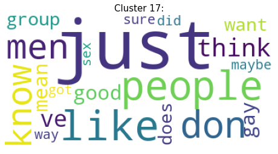

# 作业5
根据20Newsgroups数据集进行聚类，将聚类结果显示给用户，用户可以选择其中的一个类，标为关注，类的关键词作为主题，用户就可以跟踪这主题、了解主题的文章内容。

# 导入相关库


```python
from sklearn.feature_extraction.text import TfidfVectorizer
from sklearn.cluster import KMeans
import numpy as np
import re
import string
import matplotlib.pyplot as plt
import seaborn as sns
import pandas as pd
from sklearn.datasets import fetch_20newsgroups
from wordcloud import WordCloud
%matplotlib inline
```

# 数据获取
使用sklearn的fetch_20newsgroups下载数据


```python
dataset = fetch_20newsgroups(
    download_if_missing=True, remove=('headers', 'footers', 'quotes'))
```

# 数据预览
可以看到，新闻数据共有20个分类

对各类别的数量进行可视化处理


```python
dataset.target_names
```


    ['alt.atheism',
     'comp.graphics',
     'comp.os.ms-windows.misc',
     'comp.sys.ibm.pc.hardware',
     'comp.sys.mac.hardware',
     'comp.windows.x',
     'misc.forsale',
     'rec.autos',
     'rec.motorcycles',
     'rec.sport.baseball',
     'rec.sport.hockey',
     'sci.crypt',
     'sci.electronics',
     'sci.med',
     'sci.space',
     'soc.religion.christian',
     'talk.politics.guns',
     'talk.politics.mideast',
     'talk.politics.misc',
     'talk.religion.misc']


```python
# 对各类别的数量进行可视化
targets, frequency = np.unique(dataset.target, return_counts=True)
targets_str = np.array(dataset.target_names)
fig = plt.figure(figsize=(10, 5), dpi=80, facecolor='w', edgecolor='k')
plt.bar(targets_str, frequency)
plt.xticks(rotation=90)
plt.title('Class distribution of 20 Newsgroups Training Data')
plt.xlabel('News Group')
plt.ylabel('Number')
plt.show()
```


# 数据预处理
为了提升聚类的准确性，在聚类之前先对数据进行预处理，剔除数据中的数字和标点，并将大写字母转换成小写


```python
dataset_df = pd.DataFrame({'data': dataset.data, 'target': dataset.target})
# 使用正则表达式进行数据处理
def alphanumeric(x):
    return re.sub(r"""\w*\d\w*""", ' ', x)
def punc_lower(x):
    return re.sub('[%s]' % re.escape(string.punctuation), ' ', x.lower())
dataset_df['data'] = dataset_df.data.map(alphanumeric).map(punc_lower)
```

处理后的数据部分展示


```python
dataset_df.data
```


    0        i was wondering if anyone out there could enli...
    1        a fair number of brave souls who upgraded thei...
    2        well folks  my mac plus finally gave up the gh...
    3        \ndo you have weitek s address phone number   ...
    4        from article      world std com   by tombaker ...
                                   ...                        
    11309    dn  from  nyeda cnsvax uwec edu  david nye \nd...
    11310    i have a  very old  mac   and a mac plus  both...
    11311    i just installed a     cpu in a clone motherbo...
    11312    \nwouldn t this require a hyper sphere   in   ...
    11313    stolen from pasadena between     and     pm on...
    Name: data, Length: 11314, dtype: object

# K-means聚类
使用K-means聚类方法，将数据聚成20类


```python
texts = dataset.data
target = dataset.target
vectorizer = TfidfVectorizer(stop_words='english')
X = vectorizer.fit_transform(texts)
```


```python
number_of_clusters = 20
model = KMeans(n_clusters=number_of_clusters,
               init='k-means++',
               max_iter=100,
               n_init=1)
model.fit(X)
```


    KMeans(max_iter=100, n_clusters=20, n_init=1)

查看聚类后每个类别中的关键词，每个类别展示20个


```python
dict_list = []
order_centroids = model.cluster_centers_.argsort()[:, ::-1]
terms = vectorizer.get_feature_names()
for i in range(number_of_clusters):
    dict = {}
    print("Cluster %d:" % i),
    for ind in order_centroids[i, :20]:
        print(' %s' % terms[ind])
        dict[terms[ind]] = model.cluster_centers_[i][ind]
    dict_list.append(dict)
```


# 类别预测
根据模型来划分测试集的类别


```python
# 对单个词进行类别划分
X = vectorizer.transform([texts[400]])
cluster = model.predict(X)[0]
# print("这个词属于第{0}类".format(cluster))
```

```python
# 测试集预测结果可视化
count_target = dataset_df['target'].value_counts()
plt.figure(figsize=(8, 4))
sns.barplot(count_target.index, count_target.values, alpha=0.8)
plt.ylabel('Number', fontsize=12)
plt.xlabel('Target', fontsize=12)
```


# 词云图展示
对每个类别进行词云图展示


```python
for i in range(20):
    wordcloud = WordCloud(background_color="white", relative_scaling=0.5,
                          normalize_plurals=False).generate_from_frequencies(dict_list[i])
    fig = plt.figure(figsize=(8, 6))
    plt.axis('off')
    plt.title('Cluster %d:' % i, fontsize='15')
    plt.imshow(wordcloud)
    plt.show()
```





