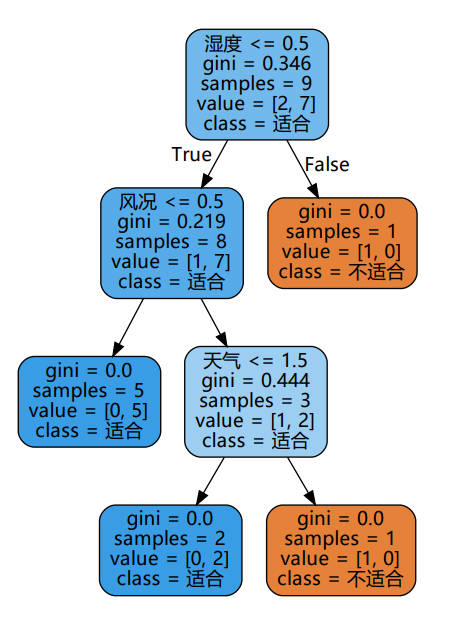

# 作业四
要求：天气因素有温度、湿度和刮风等，通过给出数据，使用决策树算法学习分类，输出一个人是运动和不运动与天气之间的规则树。

训练集和测试集可以自由定义，另外需要对温度和湿度进行概化，将数值变为概括性表述，比如温度热，温，凉爽，湿度变为高，中。


```python
from sklearn import tree
from sklearn.model_selection import train_test_split
import pandas as pd
import graphviz
import numpy as np
```

# 数据预处理

## 数据读取


```python
df = pd.read_excel('data.xlsx', index_col=None)
df
```

<table border="1" class="dataframe">
  <thead>
    <tr style="text-align: right;">
      <th></th>
      <th>天气</th>
      <th>温度</th>
      <th>湿度</th>
      <th>风况</th>
      <th>运动</th>
    </tr>
  </thead>
  <tbody>
    <tr>
      <th>0</th>
      <td>晴</td>
      <td>85</td>
      <td>85</td>
      <td>无</td>
      <td>不适合</td>
    </tr>
    <tr>
      <th>1</th>
      <td>晴</td>
      <td>80</td>
      <td>90</td>
      <td>有</td>
      <td>不适合</td>
    </tr>
    <tr>
      <th>2</th>
      <td>多云</td>
      <td>83</td>
      <td>78</td>
      <td>无</td>
      <td>适合</td>
    </tr>
    <tr>
      <th>3</th>
      <td>有雨</td>
      <td>70</td>
      <td>96</td>
      <td>无</td>
      <td>适合</td>
    </tr>
    <tr>
      <th>4</th>
      <td>有雨</td>
      <td>68</td>
      <td>80</td>
      <td>无</td>
      <td>适合</td>
    </tr>
    <tr>
      <th>5</th>
      <td>有雨</td>
      <td>65</td>
      <td>70</td>
      <td>有</td>
      <td>不适合</td>
    </tr>
    <tr>
      <th>6</th>
      <td>多云</td>
      <td>64</td>
      <td>65</td>
      <td>有</td>
      <td>适合</td>
    </tr>
    <tr>
      <th>7</th>
      <td>晴</td>
      <td>72</td>
      <td>95</td>
      <td>无</td>
      <td>不适合</td>
    </tr>
    <tr>
      <th>8</th>
      <td>晴</td>
      <td>69</td>
      <td>70</td>
      <td>无</td>
      <td>适合</td>
    </tr>
    <tr>
      <th>9</th>
      <td>有雨</td>
      <td>75</td>
      <td>80</td>
      <td>无</td>
      <td>适合</td>
    </tr>
    <tr>
      <th>10</th>
      <td>晴</td>
      <td>75</td>
      <td>70</td>
      <td>有</td>
      <td>适合</td>
    </tr>
    <tr>
      <th>11</th>
      <td>多云</td>
      <td>72</td>
      <td>90</td>
      <td>有</td>
      <td>适合</td>
    </tr>
    <tr>
      <th>12</th>
      <td>多云</td>
      <td>81</td>
      <td>75</td>
      <td>无</td>
      <td>适合</td>
    </tr>
    <tr>
      <th>13</th>
      <td>有雨</td>
      <td>71</td>
      <td>80</td>
      <td>有</td>
      <td>不适合</td>
    </tr>
  </tbody>
</table>


## 文字指标量化
为了后续决策树的计算，需要把文字指标进行量化，下面进行转换：

天气——晴-0，多元-1，有雨-2

风况——无-0，有-1

运动——不适合-0，适合-1


```python
df['天气'] = df['天气'].replace("晴", 0)
df['天气'] = df['天气'].replace("多云", 1)
df['天气'] = df['天气'].replace("有雨", 2)
df['风况'] = df['风况'].replace("无", 0)
df['风况'] = df['风况'].replace("有", 1)
df['运动'] = df['运动'].replace("不适合", 0)
df['运动'] = df['运动'].replace("适合", 1)
```

## 温湿度概化
题目要求，将温湿度数值变为概括性表述。这里将温湿度进行概述并转化为数值，具体规则如下：

温度：<70-凉爽-0，70~80-温-1，>80-热-2

湿度：>80-高-1，<=80-中-0


```python
df['温度'] = np.where(df['温度'] < 70, 0, df['温度'])
df['温度'] = np.where((df['温度'] < 80) & (df['温度'] >= 70), 1, df['温度'])
df['温度'] = np.where(df['温度'] >= 80, 2, df['温度'])
df['湿度'] = np.where(df['湿度'] > 80, 1, 0)
```

转换后的数据如下表所示：


```python
df
```

<table border="1" class="dataframe">
  <thead>
    <tr style="text-align: right;">
      <th></th>
      <th>天气</th>
      <th>温度</th>
      <th>湿度</th>
      <th>风况</th>
      <th>运动</th>
    </tr>
  </thead>
  <tbody>
    <tr>
      <th>0</th>
      <td>0</td>
      <td>2</td>
      <td>1</td>
      <td>0</td>
      <td>0</td>
    </tr>
    <tr>
      <th>1</th>
      <td>0</td>
      <td>2</td>
      <td>1</td>
      <td>1</td>
      <td>0</td>
    </tr>
    <tr>
      <th>2</th>
      <td>1</td>
      <td>2</td>
      <td>0</td>
      <td>0</td>
      <td>1</td>
    </tr>
    <tr>
      <th>3</th>
      <td>2</td>
      <td>1</td>
      <td>1</td>
      <td>0</td>
      <td>1</td>
    </tr>
    <tr>
      <th>4</th>
      <td>2</td>
      <td>0</td>
      <td>0</td>
      <td>0</td>
      <td>1</td>
    </tr>
    <tr>
      <th>5</th>
      <td>2</td>
      <td>0</td>
      <td>0</td>
      <td>1</td>
      <td>0</td>
    </tr>
    <tr>
      <th>6</th>
      <td>1</td>
      <td>0</td>
      <td>0</td>
      <td>1</td>
      <td>1</td>
    </tr>
    <tr>
      <th>7</th>
      <td>0</td>
      <td>1</td>
      <td>1</td>
      <td>0</td>
      <td>0</td>
    </tr>
    <tr>
      <th>8</th>
      <td>0</td>
      <td>0</td>
      <td>0</td>
      <td>0</td>
      <td>1</td>
    </tr>
    <tr>
      <th>9</th>
      <td>2</td>
      <td>1</td>
      <td>0</td>
      <td>0</td>
      <td>1</td>
    </tr>
    <tr>
      <th>10</th>
      <td>0</td>
      <td>1</td>
      <td>0</td>
      <td>1</td>
      <td>1</td>
    </tr>
    <tr>
      <th>11</th>
      <td>1</td>
      <td>1</td>
      <td>1</td>
      <td>1</td>
      <td>1</td>
    </tr>
    <tr>
      <th>12</th>
      <td>1</td>
      <td>2</td>
      <td>0</td>
      <td>0</td>
      <td>1</td>
    </tr>
    <tr>
      <th>13</th>
      <td>2</td>
      <td>1</td>
      <td>0</td>
      <td>1</td>
      <td>0</td>
    </tr>
  </tbody>
</table>


# 数据集划分
根据7/3的比例划分训练集和测试集


```python
data = df[['天气', '温度', '湿度', '风况']]
target = df['运动']
data = np.array(data)
target = np.array(target)
Xtrain, Xtest, Ytrain, Ytest = train_test_split(data, target, test_size=0.3)
```

# 决策树构建
这里决策树的标准选择基尼指数，最终得到分类准确率为60%


```python
clf = tree.DecisionTreeClassifier(criterion="gini")
clf = clf.fit(Xtrain, Ytrain)
score = clf.score(Xtest, Ytest)
print(score)
```

    0.6


# 可视化结果


```python
feature_name = ['天气', '温度', '湿度', '风况']
dot_data = tree.export_graphviz(clf, feature_names=feature_name, class_names=["不适合", "适合"], filled=True, rounded=True
                                )
graph = graphviz.Source(dot_data.replace(
    'helvetica', '"Microsoft YaHei"'), encoding='utf-8')
graph.view()
```



